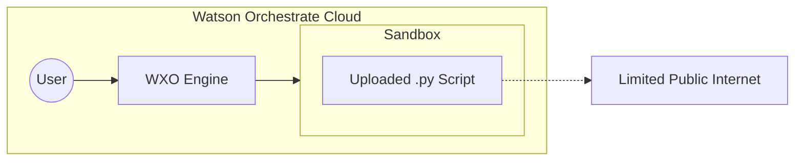
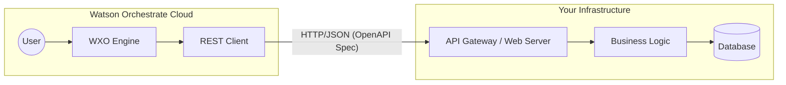
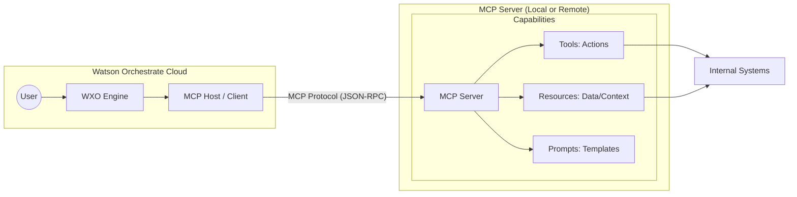
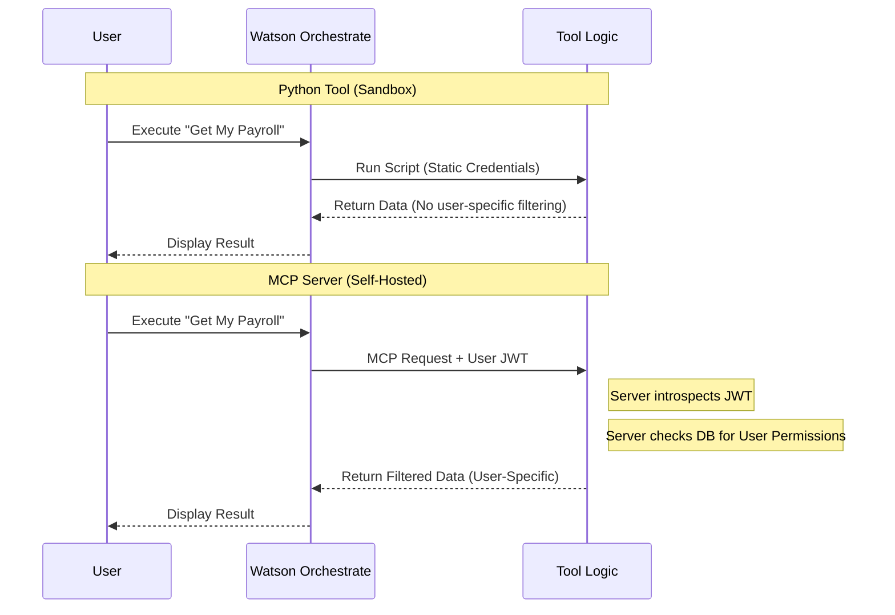

# Strategic Guide: Why MCP is the Preferred Tooling Standard for Watson Orchestrate (WXO)

This document explains the technical and strategic advantages of using the **Model Context Protocol (MCP)** within IBM Watson Orchestrate (WXO) compared to traditional Python-based or OpenAPI-based tool development.

---

## 1. Overview of Tooling Methods in WXO

There are three primary ways to extend Watson Orchestrate with custom capabilities:

1.  **Python Tools:** Custom scripts uploaded directly to WXO. They run within a restricted, ephemeral IBM-managed sandbox.
2.  **OpenAPI Tools:** External RESTful services defined by a Swagger/OpenAPI specification. WXO acts as a client to these external endpoints.
3.  **MCP (Model Context Protocol):** An open standard that enables seamless integration between AI models and external data/tools. It treats tools, resources, and prompts as a unified, discoverable service.

---

## 2. Why MCP is the Strategic Choice

While Python and OpenAPI tools have specific use cases, MCP is the superior standard for modern AI orchestration.

### Standardized Interoperability (No Vendor Lock-in)
Python tools are proprietary to the WXO sandbox. OpenAPI tools require manual mapping of REST endpoints to LLM intents. MCP is an open standard; an MCP server built for WXO can be reused with other LLM hosts (like Claude, IDEs, or custom agents) without rewriting the core logic.

### "LLM-Native" Design
OpenAPI was designed for human developers and traditional web apps, requiring strict schemas and complex manual documentation. MCP was designed specifically for LLMs. It provides a simplified JSON-RPC based communication layer that allows the LLM to "discover" capabilities and documentation more naturally.

### Dynamic Resource Access
Unlike Python or OpenAPI tools—which are generally "functional" (input -> output)—MCP introduces **Resources**. This allows WXO to not just "do things" (Tools) but also "read things" (Resources) like database schemas, file contents, or live logs in a standardized way that the LLM can browse as context.

---

## 3. Architectural Comparisons

### Python Tools Architecture
*Logic is tightly coupled to the restricted WXO Sandbox.*



### OpenAPI Tools Architecture
*Requires manual API mapping.*



### MCP Architecture (The Preferred Way)
*Standardized protocol allowing for plug-and-play tool discovery and resource sharing.*



---

## 4. Deep Dive: Limitations of Python Tools

While Python tools are easy to start with, they present significant hurdles regarding state, complexity, and security.

### The "Stateless" Constraint
Python tools in WXO are ephemeral. Every time a tool is triggered, the sandbox spins up, runs the script, and shuts down.
*   **No Persistence:** You cannot maintain state between calls (e.g., caching a session token or tracking a multi-step conversation) without an external database.
*   **MCP Advantage:** An MCP server is a persistent process. You can utilize in-memory caching (like Redis or local variables) to maintain context across multiple user interactions.

### Advanced Identity & OAuth Handling
In the WXO sandbox, you are limited to the credentials defined in the static WXO connection.
*   **The Token Introspection Problem:** In a Python tool, it is difficult to implement a full OAuth 2.0 flow where the tool acts as a Resource Server. You cannot easily intercept the bearer token and introspect it against an Identity Provider (IdP) to get user info.
*   **MCP/Server Advantage:** By hosting your own MCP server, you have full control over the transport layer. You can:
    *   **Accept Authorization Headers:** Receive the user's JWT directly.
    *   **Introspect & Validate:** Use standard libraries to validate the token and identify exactly *who* is making the request.
    *   **Tailored Responses:** Dynamically filter data or control capabilities (RBAC) based on the logged-in user's identity.

### Code Complexity and Dependency Management
*   **Library Restrictions:** You are limited to the libraries provided in the WXO environment. If you need a specific version of a library or a niche SDK, you are often out of luck.
*   **Monolithic Scripts:** As the number of tools grows it may be difficult to test and manage a large number of python tools. Adding tools requires coordination with the orchestrate server..
*   **MCP/Server Advantage:** An MCP server is a standard software project. You can use Docker, CI/CD, and any library in the Python or Node.js ecosystem, organizing code into clean, modular architectures. Once a tool is added, it is immediately available for use in WXO without additional configuration changes due to runtime tool discovery.

### Dynamic Capability Control

* In the WXO Python model, if a tool is "imported," it is available. There is no easy way to programmatically "hide" a tool based on real-time logic.
* The MCP Advantage: The MCP protocol includes a list_tools capability. When WXO asks the MCP server "What can you do?", the server can look at the user's credentials and respond with a customized list of tools.
* Example: An HR MCP server might show "View Salary" only to Managers, while showing "View Directory" to all employees. This logic stays on your server, keeping the orchestration layer clean and secure.
---

## 5. Security & Identity Flow Comparison



---

## 6. Comparison Summary

| Feature | Python Tools | OpenAPI Tools | MCP Servers |
| :--- | :--- | :--- | :--- |
| **Execution Env** | WXO Sandbox (Restricted) | External Web Server | Flexible (Local/Cloud/Container) |
| **State Management** | Stateless (Ephemeral) | Persistent (Server-side) | **Persistent (Server-side)** |
| **Identity/OAuth** | Limited/Static | Standard REST Auth | **Full JWT Introspection/RBAC** |
| **Discovery** | Manual | Manual via OpenAPI Spec | **Automatic Discovery** |
| **Reusability** | Low (WXO only) | Medium (Any REST client) | **High (Any MCP Host)** |
| **Complexity** | Low (for simple tasks) | High (requires infra) | **Medium (Standardized)** |

---

## 7. Conclusion

For simple, stateless calculations, **Python tools** are sufficient. For existing enterprise services, **OpenAPI** remains the legacy standard. However, for **enterprise-grade AI capabilities**, **MCP** is the superior choice. It allows Watson Orchestrate to interact with your data using a protocol optimized for LLMs while providing the developer full control over security, identity, and state management.

### Technical Deep Dive: MCP vs. REST

To understand why MCP is preferred for AI orchestration, it is helpful to look under the hood at how it differs from the REST (Representational State Transfer) architecture that has dominated web development for the last two decades.

---

#### 1. The Protocol: JSON-RPC vs. Resource-Oriented HTTP
While REST is an architectural style that uses HTTP verbs (GET, POST, DELETE) to act upon "Resources" (URLs), **MCP is a transport-agnostic protocol based on JSON-RPC 2.0.**

*   **REST (Noun-Based):** You interact with nouns. To get a list of tools, you might `GET /api/v1/tools`. To run one, you might `POST /api/v1/tools/calculator/run`.
*   **MCP (Method-Based):** You interact with methods. There is typically no complex URL tree. Instead, you send a JSON object to a single endpoint that specifies exactly what "method" you want to execute.

**Example of an MCP Request (JSON-RPC):**
```json
{
  "jsonrpc": "2.0",
  "id": "1",
  "method": "tools/call",
  "params": {
    "name": "get_customer_info",
    "arguments": { "customer_id": "C-123" }
  }
}
```

#### 2. The Endpoint Strategy: Single Entry Point vs. Resource Tree
In a REST API, the "intelligence" of the interface is baked into the URL structure. In MCP, the intelligence is in the **Schema Handshake**.

*   **REST Pattern:** You have dozens of endpoints: `/users`, `/orders`, `/inventory`, `/auth`. The client must know these paths in advance.
*   **MCP Pattern:** There are typically only two primary endpoints used during a session:
    1.  **The Connection Endpoint (`/sse`):** Used to establish a persistent, long-lived stream (Server-Sent Events).
    2.  **The Message Endpoint (`/messages`):** A single `POST` endpoint where all JSON-RPC commands (like calling a tool or listing a resource) are sent.

#### 3. The Lifetime of an MCP Interaction
Unlike the "Request-Response-Close" cycle of REST, an MCP interaction over HTTP typically follows a **Stateful Session** lifecycle. This is critical for WXO because it allows the server to maintain context about the user and the conversation.

**The Lifecycle Steps:**
1.  **Establishment (The SSE Handshake):** The WXO (Client) opens an HTTP connection to the MCP Server's `/sse` endpoint. The server responds with a `text/event-stream`. This connection stays open.
2.  **Initialization:** WXO sends an `initialize` request. The server responds with its capabilities (e.g., "I support tools and resources") and its metadata.
3.  **Discovery:** WXO calls `tools/list`. The server returns a JSON array of every tool it supports, including their descriptions and input schemas (JSON Schema).
4.  **Execution (The Upstream):** When the LLM decides to use a tool, WXO sends a `POST` to the `/messages` endpoint containing the `tools/call` method.
5.  **Response (The Downstream):** The server processes the logic and sends the result back through the **already open SSE stream**.
6.  **Persistence:** Because the SSE connection is still open, the server can maintain local variables, database connections, or cached authentication tokens for the duration of that session.

#### 4. Technical Comparison Table

| Feature | REST | MCP (JSON-RPC over SSE) |
| :--- | :--- | :--- |
| **Communication** | Stateless (usually) | **Stateful Session** |
| **Data Flow** | Unidirectional (Client -> Server) | **Bi-directional** (Server can push updates) |
| **Discovery** | Manual (Swagger/OpenAPI) | **Automatic** (via `tools/list`) |
| **Error Handling** | HTTP Status Codes (404, 500, etc.) | **JSON-RPC Error Objects** inside a 200 OK |
| **Coupling** | High (Client must know URL paths) | **Low** (Client only needs the base URL) |

---

### Why this matters for WXO
In the REST/OpenAPI model, WXO has to parse a massive Swagger file and try to map LLM intents to specific URL paths and HTTP verbs. This is brittle and prone to mapping errors.

In the **MCP model**, WXO simply asks the server: *"What can you do?"* The server responds with a standardized list of methods. When WXO wants to execute one, it sends a single, standardized JSON-RPC packet. This makes the integration **faster, more secure (due to the persistent session), and significantly more robust** for complex AI workflows.
