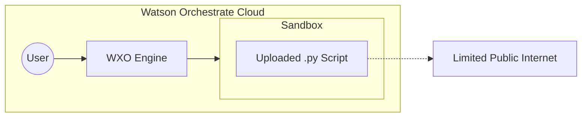
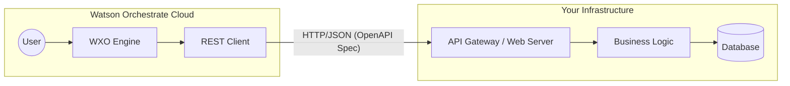
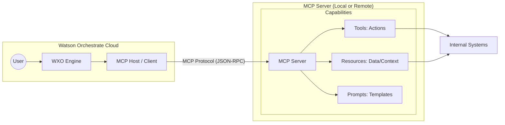
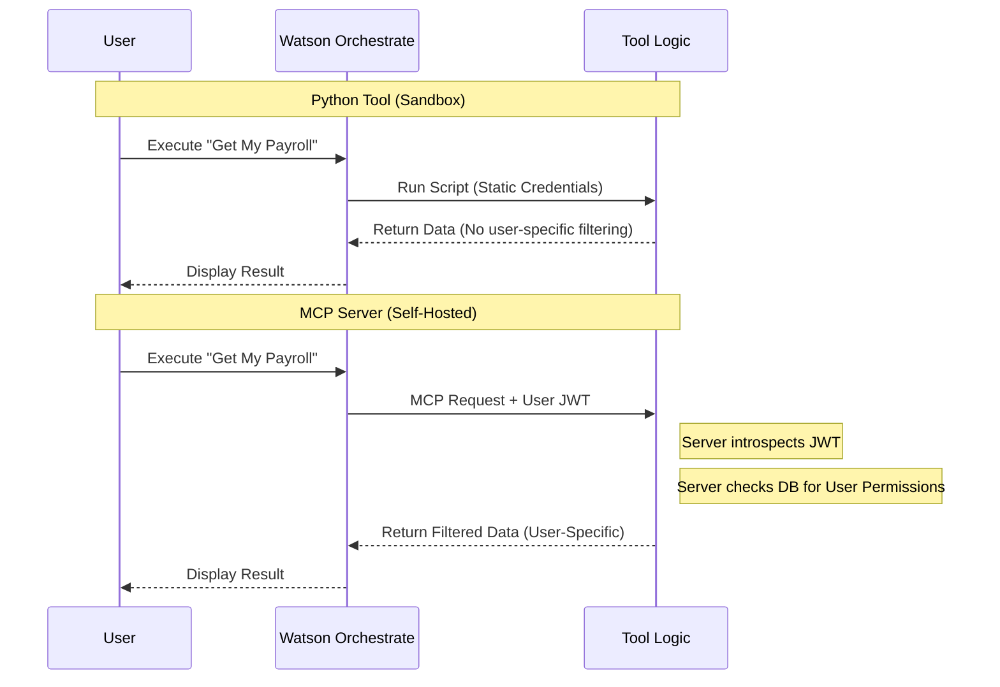

# Strategic Guide: Why MCP is the Preferred Tooling Standard for Watson Orchestrate (WXO)

This document explains the technical and strategic advantages of using the **Model Context Protocol (MCP)** within IBM Watson Orchestrate (WXO) compared to traditional Python-based or OpenAPI-based tool development.

---

## 1. Overview of Tooling Methods in WXO

There are three primary ways to extend Watson Orchestrate with custom capabilities:

1.  **Python Tools:** Custom scripts uploaded directly to WXO. They run within a restricted, ephemeral IBM-managed sandbox.
2.  **OpenAPI Tools:** External RESTful services defined by a Swagger/OpenAPI specification. WXO acts as a client to these external endpoints.
3.  **MCP (Model Context Protocol):** An open standard that enables seamless integration between AI models and external data/tools. It treats tools, resources, and prompts as a unified, discoverable service.

---

## 2. Why MCP is the Strategic Choice

While Python and OpenAPI tools have specific use cases, MCP is the superior standard for modern AI orchestration.

### Standardized Interoperability (No Vendor Lock-in)
Python tools are proprietary to the WXO sandbox. OpenAPI tools require manual mapping of REST endpoints to LLM intents. MCP is an open standard; an MCP server built for WXO can be reused with other LLM hosts (like Claude, IDEs, or custom agents) without rewriting the core logic.

### "LLM-Native" Design
OpenAPI was designed for human developers and traditional web apps, requiring strict schemas and complex manual documentation. MCP was designed specifically for LLMs. It provides a simplified JSON-RPC based communication layer that allows the LLM to "discover" capabilities and documentation more naturally.

### Dynamic Resource Access
Unlike Python or OpenAPI tools—which are generally "functional" (input -> output)—MCP introduces **Resources**. This allows WXO to not just "do things" (Tools) but also "read things" (Resources) like database schemas, file contents, or live logs in a standardized way that the LLM can browse as context.

---

## 3. Architectural Comparisons

### Python Tools Architecture
*Logic is tightly coupled to the restricted WXO Sandbox.*

### OpenAPI Tools Architecture
*Requires manual API mapping.*

### MCP Architecture (The Preferred Way)
*Standardized protocol allowing for plug-and-play tool discovery and resource sharing.*

---

## 4. Deep Dive: Limitations of Python Tools

While Python tools are easy to start with, they present significant hurdles regarding state, complexity, and security.

### The "Stateless" Constraint
Python tools in WXO are ephemeral. Every time a tool is triggered, the sandbox spins up, runs the script, and shuts down.
*   **No Persistence:** You cannot maintain state between calls (e.g., caching a session token or tracking a multi-step conversation) without an external database.
*   **MCP Advantage:** An MCP server is a persistent process. You can utilize in-memory caching (like Redis or local variables) to maintain context across multiple user interactions.

### Advanced Identity & OAuth Handling
In the WXO sandbox, you are limited to the credentials defined in the static WXO connection.
*   **The Token Introspection Problem:** In a Python tool, it is difficult to implement a full OAuth 2.0 flow where the tool acts as a Resource Server. You cannot easily intercept the bearer token and introspect it against an Identity Provider (IdP) to get user info.
*   **MCP/Server Advantage:** By hosting your own MCP server, you have full control over the transport layer. You can:
    *   **Accept Authorization Headers:** Receive the user's JWT directly.
    *   **Introspect & Validate:** Use standard libraries to validate the token and identify exactly *who* is making the request.
    *   **Tailored Responses:** Dynamically filter data or control capabilities (RBAC) based on the logged-in user's identity.

### Code Complexity and Dependency Management
*   **Library Restrictions:** You are limited to the libraries provided in the WXO environment. If you need a specific version of a library or a niche SDK, you are often out of luck.
*   **Monolithic Scripts:** As the number of tools grows it may be difficult to test and manage a large number of python tools. Adding tools requires coordination with the orchestrate server..
*   **MCP/Server Advantage:** An MCP server is a standard software project. You can use Docker, CI/CD, and any library in the Python or Node.js ecosystem, organizing code into clean, modular architectures. Once a tool is added, it is immediately available for use in WXO without additional configuration changes due to runtime tool discovery.

---

## 5. Security & Identity Flow Comparison

---

## 6. Comparison Summary

| Feature | Python Tools | OpenAPI Tools | MCP Servers |
| :--- | :--- | :--- | :--- |
| **Execution Env** | WXO Sandbox (Restricted) | External Web Server | Flexible (Local/Cloud/Container) |
| **State Management** | Stateless (Ephemeral) | Persistent (Server-side) | **Persistent (Server-side)** |
| **Identity/OAuth** | Limited/Static | Standard REST Auth | **Full JWT Introspection/RBAC** |
| **Discovery** | Manual | Manual via OpenAPI Spec | **Automatic Discovery** |
| **Reusability** | Low (WXO only) | Medium (Any REST client) | **High (Any MCP Host)** |
| **Complexity** | Low (for simple tasks) | High (requires infra) | **Medium (Standardized)** |

---

## 7. Conclusion

For simple, stateless calculations, **Python tools** are sufficient. For existing enterprise services, **OpenAPI** remains the legacy standard. However, for **enterprise-grade AI capabilities**, **MCP** is the superior choice. It allows Watson Orchestrate to interact with your data using a protocol optimized for LLMs while providing the developer full control over security, identity, and state management.
